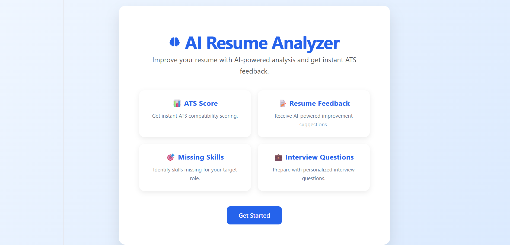
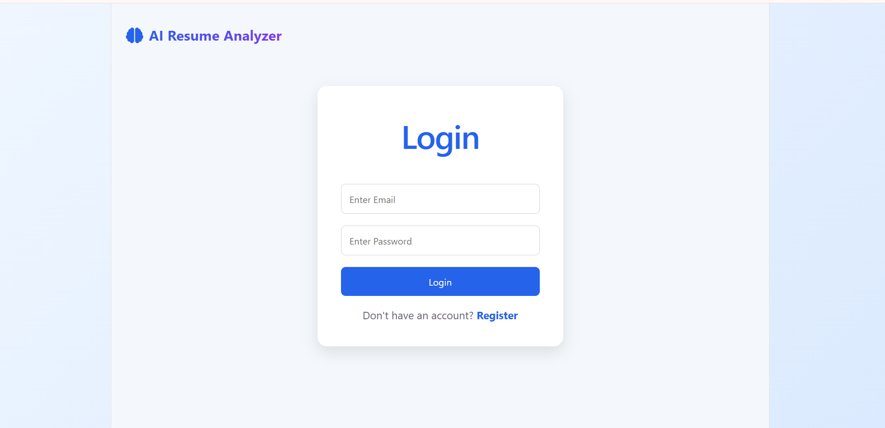
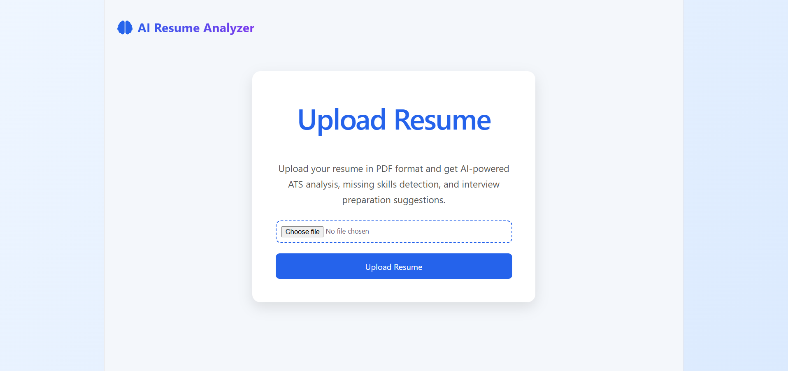
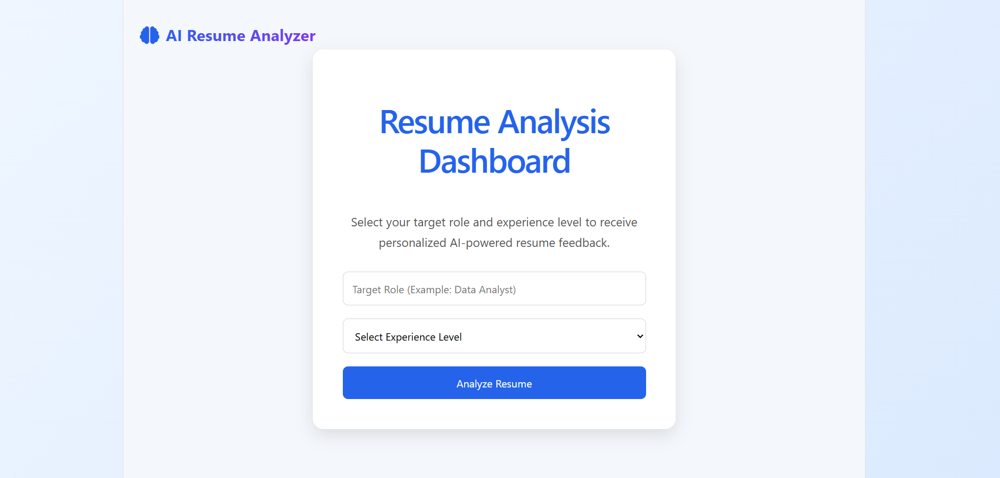
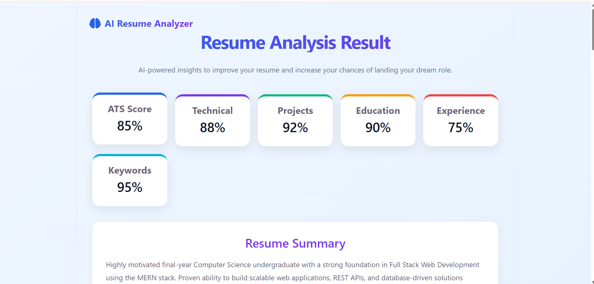
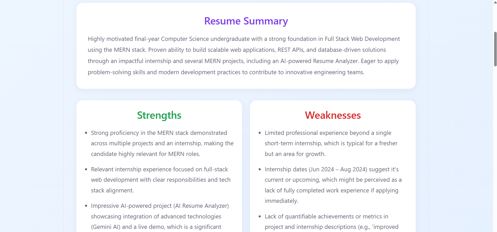
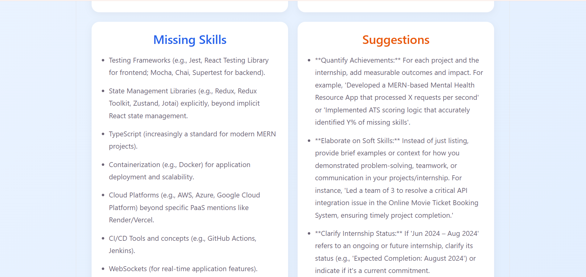
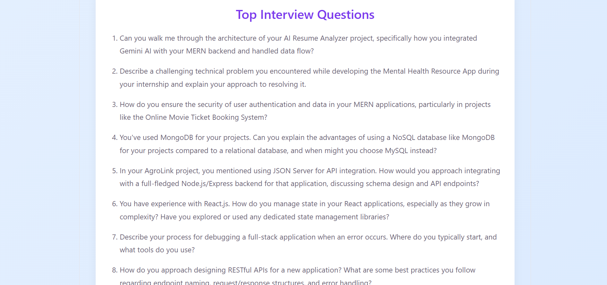
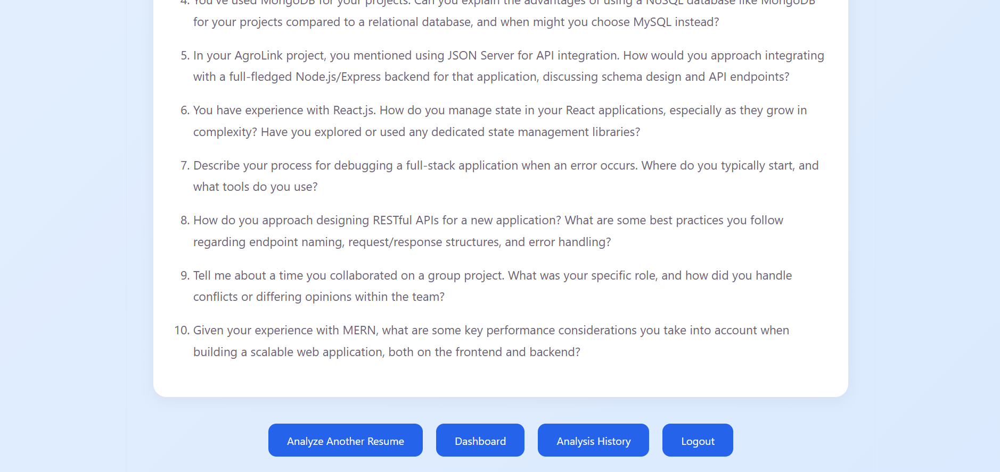
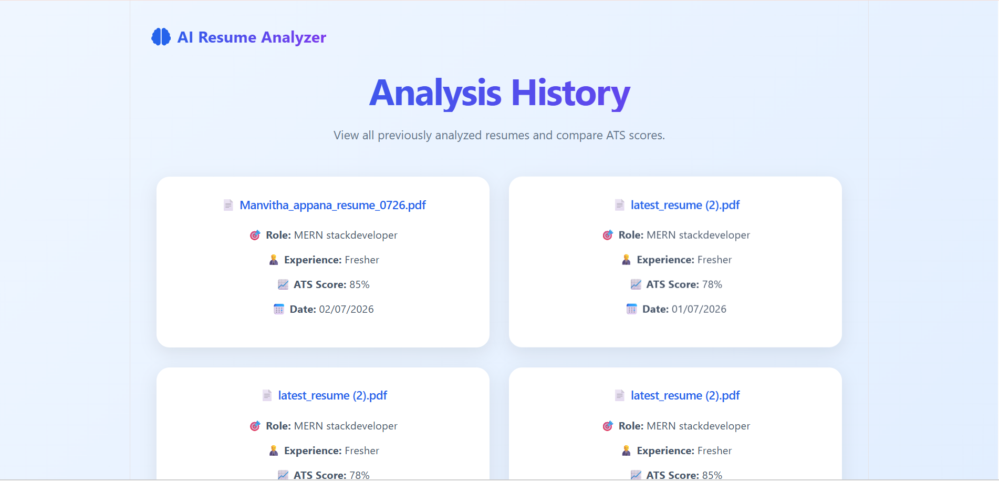

# AI Resume Analyzer 🚀

An AI-powered Resume Analyzer built with the **MERN Stack** and **Google
Gemini AI** to provide ATS-style resume evaluation, skill gap analysis,
and interview preparation recommendations.

## 🌐 Live Demo

-   Frontend: https://ai-resume-analyzer-mern.vercel.app/
-   Backend API: https://ai-resume-analyzer-mern.onrender.com

## 📂 GitHub Repository

-   https://github.com/Manvitha-Appana/AI-Resume-Analyzer-MERN

## ✨ Features

-   User Registration and Login
-   Resume Upload in PDF format
-   Resume Text Extraction
-   ATS Score Generation
-   Technical, Projects, Education and Keywords Scoring
-   AI Generated Resume Summary
-   Strengths and Weaknesses Analysis
-   Missing Skills Detection
-   Interview Question Generation
-   Analysis History Tracking
-   Responsive UI
-   Cloud Deployment with Render and Vercel

## 🛠️ Tech Stack

### Frontend

-   React.js
-   React Router DOM
-   Axios
-   CSS

### Backend

-   Node.js
-   Express.js
-   MongoDB
-   Mongoose
-   JWT Authentication
-   Multer
-   PDF Parse

### AI

-   Google Gemini AI API

## 📁 Project Structure

``` text
client/
 ├── src/
 ├── components/
 ├── pages/
 └── services/

server/
 ├── controllers/
 ├── models/
 ├── routes/
 ├── services/
 └── uploads/
```

## ⚙️ Installation

### Clone Repository

``` bash
git clone https://github.com/Manvitha-Appana/AI-Resume-Analyzer-MERN.git
```

### Install Frontend Dependencies

``` bash
cd client
npm install
npm run dev
```

### Install Backend Dependencies

``` bash
cd server
npm install
npm run dev
```

## 🔐 Environment Variables

### Backend (.env)

``` env
MONGO_URI=your_mongodb_connection_string
JWT_SECRET=your_secret_key
GEMINI_API_KEY=your_gemini_api_key
```

### Frontend (.env)

``` env
VITE_API_URL=http://localhost:5000
```

## 📸 Screenshots

Add screenshots here:
-home Page



- Login Page



- Resume Upload 


- Dashboard
 

-Analysis Result 





 
- Analysis History


## 👩‍💻 Author

**Appana Manvitha**

-   LinkedIn: https://www.linkedin.com/in/appana-manvitha/
-   GitHub: https://github.com/Manvitha-Appana
